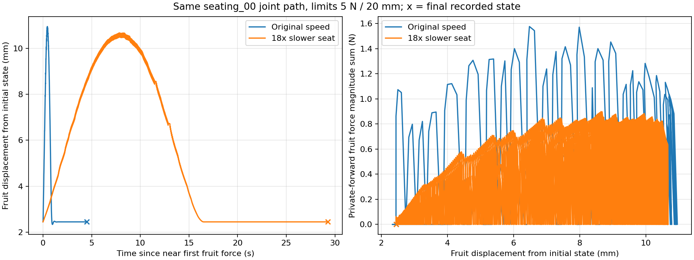

# 힘·변위 중단값 비교 — 서버 결과

2026-09-28. 기준 `b75e6bc29e5106a81c918a949f2cae76d30f9dc2`.
작업 브랜치 `codex/contact-limit-sweep-20260928`.

## 결론

**중단값을 완화하면 전체 동작이 완료되는 경로가 있다. 하지만 목표 꼭지가 뒤쪽 와이어에 실제 접촉하며 안착·유지되는 증거는 아직 확보하지 못했다.**

추가12회 중 전체 동작 완료3회, 목표 힘 중단1회, 목표 변위 중단5회, 비허용 중심가지 접촉 중단3회다. 모든 경로의 명목 전체 검사는 완료·통과했다. 이번12회는 이전6회와 별도 실험이며 이전 결과를 덮어쓰지 않았다.

완료된 00번/04번/감속00번의 실제 목표 과실 최대 힘은 각각1.577N/1.585N/0.899N, 최대 변위는10.951mm/10.628mm/10.673mm였다. **기존1N/5mm는 이 동작들의 끝까지 진행을 관찰하기에는 낮았다.** 그러나 이를 실물에서 안전한 힘·변위 기준으로 바꿔 해석하지 않는다. 이번5N은 중단 상한이며 실제5N이 가해졌다는 뜻이 아니다.

## 실험 조건

사용자의 “변위와 힘 모두 달리해서 성공하는지도 체크” 요청에 따라 실행 전 다음12회를 정했다.

- 00번 원래 속도 및 기존18배 감속 각각: 2N/5mm, 1N/10mm, 2N/10mm — 6회.
- 기존00/03/04/05/06번 및 감속00번: 5N/20mm — 6회.
- 기존1N/5mm 결과는 앞선 보고서에서 비교 기준으로 사용했다. 이 조건을 다시 실행하지 않았다.

새 경로/IK/로봇 제어/물성은 생성하거나 수정하지 않았다. 원본과 기존 감속 trace를 그대로 사용했다. 각 실행은 동일한 정상 초기 상태에서 시작했고, 전체 조건부 검사 통과 후 물리를 실행했다. 목표 과실과 와이어의 기존 허용만 유지하며 **비허용 접촉력 합0.01N 및 침투0.5mm 중단 기준은 변경하지 않았다.**

`training_eligible=false`, `hook_success=null` 유지. SIM-GT 오프라인 진단이며 학습 데이터에 넣지 않았다.

## 12회 전체 결과

힘은 접촉별3D 힘 크기 합의 최대이며 live 이전 solve와 현재 private-forward 중 큰 값이다. 서로 다른 시점의 힘을 더하지 않는다. 목표 꼭지 힘은 전 실행0이므로 아래 과실 힘과 구분된다. 변위는 초기 상태 대비 전체 실행 중 최댓값이다.

| 경로/속도 | 힘 상한 N | 변위 상한 mm | 완료/중단 | 시각 s | 실제 과실 힘 N | 실제 변위 mm | 비허용 힘 N | 기하 안착 표본 |
|---|---:|---:|---|---:|---:|---:|---:|---:|
| 00 원래 속도 | 2 | 5 | 목표 변위 중단 | 16.2125 | 1.309 | 5.096 | 0.000 | 0 |
| 00 원래 속도 | 1 | 10 | 목표 힘 중단 | 16.1125 | 1.074 | 2.968 | 0.000 | 0 |
| 00 원래 속도 | 2 | 10 | 목표 변위 중단 | 16.4333 | 1.577 | 10.060 | 0.000 | 0 |
| 00 감속18배 | 2 | 5 | 목표 변위 중단 | 28.3000 | 0.604 | 5.015 | 0.000 | 0 |
| 00 감속18배 | 1 | 10 | 목표 변위 중단 | 32.4625 | 0.899 | 10.002 | 0.000 | 0 |
| 00 감속18배 | 2 | 10 | 목표 변위 중단 | 32.4625 | 0.899 | 10.002 | 0.000 | 0 |
| 00 원래 속도 | 5 | 20 | 전체 동작 완료 | 20.6000 | 1.577 | 10.951 | 0.000 | 51 |
| 03 원래 속도 | 5 | 20 | 비허용 접촉 중단 | 16.7667 | 1.505 | 10.025 | 0.638 | 0 |
| 04 원래 속도 | 5 | 20 | 전체 동작 완료 | 20.6667 | 1.585 | 10.628 | 0.000 | 750 |
| 05 원래 속도 | 5 | 20 | 비허용 접촉 중단 | 16.5958 | 1.539 | 11.141 | 1.017 | 0 |
| 06 원래 속도 | 5 | 20 | 비허용 접촉 중단 | 16.6625 | 1.557 | 11.063 | 0.978 | 0 |
| 00 감속18배 | 5 | 20 | 전체 동작 완료 | 55.7333 | 0.899 | 10.673 | 0.000 | 0 |

전체12회에서 목표 과실 침투는 검출되지 않았다. 전체 활성 접촉의 최대 침투0.228mm는 초기 physics step에서 발생했으며 기존0.5mm 이내다. 중단 전 수치/침투 유효성은 모두 통과했다. 이는 활성 충돌체의 이산 검사이며 시각 메시 전체나 스텝 사이의 비관통 보증은 아니다.

## 완료와 실제 걸림의 차이

- **00번 원래 속도:** 20.6s 전체 완료. 기하 안착 표본51개가 있었지만 hold/verify에서는0. 목표 꼭지 접촉력0. hold의 뒤쪽 와이어 최소 표면 간격은 약1.514~1.526mm였다.
- **04번 원래 속도:** 20.6667s 전체 완료. 기하 안착 표본750개. hold344/344개가 기하 조건 안에 있었고 실제 경과1.4292s, 최대 표본 간격1/240s였다. 그러나 목표 꼭지 접촉력0. verify는398개 중302개만 기하 조건을 만족했다. hold의 가까운 뒤쪽 와이어 간격은 약1.388~1.473mm, verify에서는약1.411~1.511mm였다.
- **00번 감속:** 55.7333s 전체 완료. 목표 과실 힘 최대0.899N으로 감소했지만 기하 안착 표본0, 목표 꼭지 접촉력0. 마지막 꼭지/뒤쪽 와이어 간격은 약1.518mm였다.

이번 기하 판정은 가까운 표면 간격1.5mm까지 허용하는 후보 판정이다. 이 범위에 들어왔다는 사실이 물리 접촉을 의미하지 않는다. 실제 접촉력·정확한 꼭지/뒤쪽 와이어 쌍·timestamp 기반 hold/verify를 함께 요구하는 기존 증거 기준은 세 완료 경로 모두 통과하지 못했다. `legacy_evidence`도 보존했다.

따라서 결과는 **“전체 모션 완료3회, 실제 접촉 기반 안착·유지 확인0회”**다. 느슨한 기하 구속이 존재하는지까지 부정하는 결과는 아니지만, 현재 확인 동작만으로 기계적 걸림/탈출 방지를 입증하지 못했다.

## 비목표 접촉으로 중단된 경로

| 경로 | 중단 시각 | 실제 접촉 쌍 | 비허용 힘 크기 합 최대 |
|---|---:|---|---:|
| 03 | 16.7667s | g389 ↔ glb_col_TRUSS_Rachis_04 | 0.638N |
| 05 | 16.5958s | g390 ↔ glb_col_TRUSS_Rachis_03 | 1.017N |
| 06 | 16.6625s | g389 ↔ glb_col_TRUSS_Rachis_04 | 0.978N |

Rachis 번호는 중심가지 충돌체 이름이며 과실 번호를 뜻하지 않는다. 명목 전체 검사는 초기 식물 상태에서 통과했지만 실제 움직이는 식물과 로봇 추종을 포함한 실행 중에는 금지 접촉이 나타났다. 표는 해당 실행에서 관측한 결과이며 어느 변형/추종 오차가 주원인인지는 아직 분리하지 않았다. 이 접촉을 타깃 주변이라는 이유로 허용하지 않았다.

## 힘·변위 제한의 효과

00번 원래 속도에서 1N/10mm는 기존1N/5mm와 같은 힘 중단점에서 멈췄다. 2N/5mm와2N/10mm는 각각 변위 제한까지 진행했다. 감속00번의2N/5mm는 기존1N/5mm와 같은 위치, 1N/10mm와2N/10mm도 서로 같은 위치에서 멈췄다. 힘 상한을 올려도 변위 상한이 그대로면 진행이 늘어나지 않는 경우다.

5N/20mm에서 00번/04번은 과실을 약11mm까지 밀었다가 접촉이 줄어든 뒤 전체 모션을 완료했다. 감속은 최대 하중을 줄였으나 최종 꼭지 접촉을 만들지는 못했다.



그래프는 private-forward 힘 합이다. 원래 속도와 감속의 시간축을 첫 과실 힘 발생 부근에 맞췄다. x표시는 최종 상태다. 힘0 표본도 유지했으며, 높은 주파수의 접촉/무접촉 변화를 평활화해 숨기지 않았다. live 원자료도 별도 보존되어 있다.

## 검증 및 저장 자료

- 전체12회 조건부 경로 검사 완료·통과. 실행기·물리 코드는 기준b75e6bc 그대로다.
- 각 실행 source model/manifest/reference/trace/plan/base-policy의 SHA256을 다시 검사해 원본 보존 확인.
- 매240Hz timestamp 누락0. hold/verify는 실제 시간과 간격으로 판정했다.
- 각 실행과 이전1N/5mm 기준 실행의 공통 저장 timestamp에서 실제 전체 qpos를 비교했다. **12개 모두 최대 차이0**. 중단 기준 변경 전에 실제 물리 진행도 동일함을 확인했다.
- 기존193개 단위/native/계획 회귀 통과 상태의 코드에 새 물리 변경은 없다. 이번 추가 검증은12회 실제 실행과 위 원본/상태/시간 검증이며193개를 새로 실행한 것으로 집계하지 않는다.
- 원자료는 실제30fps 안팎 qpos 영상 상태와240Hz 접촉/판정 파일을 분리 보존했다. 영상 렌더는 물리를 재실행하지 않는다. 영상 자막 `seated`는 기하 후보 판정이며 hook_success가 아니다.
- 보고서/전체 표/원자료/대표4개 영상/그래프/후처리 스크립트를 Git에 보존했다. 대형 MJB·메시는 원래 서버에 유지한다.

[최종 JSON](validation/contact_limit_sweep_20260928/results.json) · [원본 및 재현 검증](validation/contact_limit_sweep_20260928/verification.json) · [증거 목록](validation/contact_limit_sweep_20260928/README.md) · [영상 전체 디코드 검사](validation/contact_limit_sweep_20260928/video_validation.json)

실제 저장 상태 영상: [00 완료](validation/contact_limit_sweep_20260928/videos/original_00_f5_d20.mp4), [04 완료](validation/contact_limit_sweep_20260928/videos/original_04_f5_d20.mp4), [03 중심가지 접촉 중단](validation/contact_limit_sweep_20260928/videos/original_03_f5_d20.mp4), [00 감속 완료](validation/contact_limit_sweep_20260928/videos/slow18_00_f5_d20.mp4).

호스트 대시보드:

```text
file:///home/rdv/docker_share/mujoko_debugging_data/20260928_contact_limit_sweep/index.html
```

## GPT-6 Pro와 논의할 판단

중단값 완화로 전체 모션을 확보했으므로, 지금 남은 문제를 모두 힘·변위 제한 탓으로 볼 수는 없다. 특히04번은 유지 동안 기하상 가까운 상태를 만들었지만 뒤쪽 와이어와 약1.4mm 간격이 남고 접촉력은0이었다.

후속 검토는 04번의 마지막 안착 위치·회전과 확인 동작이 실제 꼭지/뒤쪽 와이어 접촉 또는 기계적 구속을 입증하기에 적절한지에 집중하는 것이 타당하다. 03/05/06번의 Rachis 접촉은 별도 회피 대상이다. 추가 임계값 상향만으로 성공 판정을 만드는 방식은 이번 자료가 뒷받침하지 않는다. 실제 과실 손상, 실물 안전, 기계적 포획·수확 분리는 계속 미검증이다.
