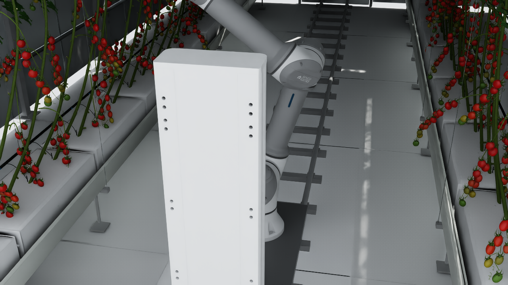

# NVIDIA Isaac Sim - Smart Farm Tomato Harvesting Simulation

This directory contains the autonomous smart farm tomato harvesting robot simulation environment built for **NVIDIA Isaac Sim (5.1+) / IsaacLab**.



---

## 1. Overview & Components

The environment seamlessly combines the high-fidelity smart farm greenhouse USD with the customized harvesting robot:

1. **Smart Farm Greenhouse (`env_usd/`)**:
   - High-fidelity tomato greenhouse with 54 tomato crop vines across two lateral cultivation rows.
   - Includes hydroponic rockwool slabs, drainage gutters, overhead support trusses, heating rails, and natural solar lighting.
   - **Environment Scaling (50%)**: By default, the greenhouse is scaled to **50% (0.5x)** non-destructively in the composite scene (`scenes/farmily_greenhouse_robot.usd`) to match realistic robotic workspace proportions:
     - Cultivation row positions: $X \approx -0.75\text{ m}$ (Left) and $X \approx +0.75\text{ m}$ (Right) with a 1.5 m central aisle.
     - Hydroponic bed height: $0.32\text{ m}$.
     - Plant canopy height: $1.26\text{ m}$ (total height from ground $\approx 1.58\text{ m}$).
     - The original USD (`env_usd/tomato_greenhouse_upgraded_with_stems_and_clusters_v2_isaac.usd`) remains completely untouched in 1:1 scale.

2. **Harvesting Robot (`robot_usd/rb5_farmily.usd`)**:
   - Kept at **1:1 original physical scale** (RB5-850e 850 mm reach, linear lift 0.0 ~ 0.75 m).
   - **Base & Linear Lift**: Prismatic elevator column with 0.0 to 0.75 m vertical travel range (`farmily_lift_height_joint`). Tuned with heavy-duty PhysX linear drive ($K_p = 50,000\text{ N/m}$, $K_d = 2,500\text{ Ns/m}$, $F_{\max} = 10,000\text{ N}$) to smoothly hoist the 42 kg manipulator payload against gravity.
   - **Manipulator**: Rainbow Robotics RB5-850e 6-DOF industrial collaborative robot arm (`base`, `shoulder`, `elbow`, `wrist1`, `wrist2`, `wrist3`).
   - **End-Effector**: Custom 3D-printed tomato harvest gripper (`assy_gripper_ver_3_1`).
   - **Vision**: Intel RealSense D435 RGB-D eye-in-hand camera mount attached to the tool flange.
   - Rigid-body physics inertia tensors and mass profiles are fully calculated and integrated.

3. **Composite Stage (`scenes/farmily_greenhouse_robot.usd`)**:
   - Unified stage referencing the greenhouse (0.5x scale) and harvesting robot (1.0x scale) with default gravity ($-9.81\text{ m/s}^2$), collision ground plane, Distant Sunlight, Dome Light.
   - **Mounted on Heating Rails between Gutters**:
     - Central heating pipe rails: $X \in [-0.12, +0.12]\text{ m}$ (24 cm gauge at 50% scale), rail top $Z = 0.062\text{ m}$.
     - Left gutter: $X \approx -0.77\text{ m}$, Right gutter: $X \approx +0.77\text{ m}$.
     - Robot spawn position: `(0.00, 1.00, 0.075)` with $180^\circ$ Yaw.
     - The robot platform sits directly on top of the two rails centered at $X = 0.00\text{ m}$, providing equidistant reach ($0.77\text{ m} < 0.85\text{ m}$ reach limit) to harvest tomato vines from both the left and right gutters.
   - An `/World/OverviewCamera` positioned inside the aisle looking down the track at the robot and tomato crops.

---

## 2. Directory Structure

```
nvidia-sim/
├── README.md                      # This documentation
├── run_sim.sh                     # Master one-click launcher script
├── env_usd/
│   └── tomato_greenhouse_upgraded_with_stems_and_clusters_v2_isaac.usd  # Greenhouse environment
├── robot_usd/
│   ├── rb5_farmily.urdf           # Standalone URDF with absolute meshes & mass tensors
│   ├── rb5_farmily.usd            # Converted PhysX Articulation robot USD
│   ├── config.yaml                # IsaacLab URDF converter configuration
│   └── configuration/             # Converted URDF sub-assets
├── scenes/
│   ├── farmily_greenhouse_robot.usd  # Master composite stage (World + Greenhouse + Robot + Camera)
│   ├── create_composite_scene.py  # Automated generator for master stage
│   └── simulation_preview.png     # Rendered camera preview
└── scripts/
    ├── generate_robot_usd.py      # URDF extraction and PhysX joint tuning pipeline
    ├── test_robot_spawn.py        # Automated test verification suite
    └── run_farm_simulation.py     # Interactive & headless simulation runner with harvest cycle demo
```

---

## 3. Quick Start & Execution

### One-Click Launcher (`./run_sim.sh`)

The launcher automatically sets up Python 3.11, the Isaac Sim runtime, and active display settings (`DISPLAY=:47`).

#### 1. Interactive GUI Mode (Default)
Opens the Isaac Sim GUI window with the overview camera looking down the aisle at the robot and tomato canopy:
```bash
cd /root/farmily_tomato/nvidia-sim
./run_sim.sh
```

#### 2. Greenhouse Scale Options (1배 원본 vs 0.5배 축소)
스케일 옵션(`--scale`)을 사용하여 언제든지 온실 크기를 1배(원본 100%) 또는 0.5배(50%)로 즉시 전환하여 실행할 수 있습니다:
```bash
# 1배 (100% 원본 온실 스케일)로 실행
./run_sim.sh --scale 1.0

# 0.5배 (50% 축소 온실 스케일)로 실행
./run_sim.sh --scale 0.5
```
*스케일 변경 시 레일 위치, 로봇 안착 높이, 카메라 시점 좌표가 온실 크기에 맞추어 자동으로 계산 및 갱신됩니다.*

#### 3. Headless Simulation
Runs the simulation in headless mode for benchmarking, training, or headless CI:
```bash
./run_sim.sh --headless --steps 500
```

The D435 eye-in-hand camera publishes ROS 2 data by default in both GUI and
headless modes:

- `/camera/d435/color/image_raw` (`sensor_msgs/Image`)
- `/camera/d435/color/camera_info` (`sensor_msgs/CameraInfo`)
- `/camera/d435/depth/image_raw` (`sensor_msgs/Image`, `32FC1` meters)
- `/camera/d435/depth/camera_info` (`sensor_msgs/CameraInfo`)
- `/camera/d435/depth/points` (`sensor_msgs/PointCloud2`)
- `/clock` (`rosgraph_msgs/Clock`)

Use `--camera-width` and `--camera-height` to change the default `640x480`
resolution, or `--no-ros2-camera` when rendering and ROS publishing are not
needed.

```bash
./run_sim.sh --headless --camera-width 640 --camera-height 480
ros2 topic hz /camera/d435/color/image_raw
```

#### 4. Automated Physics Verification Suite
Runs automated sanity checks verifying stage loading, 54 plant prims, 7 DOFs, numerical stability (zero NaNs), and active joint PD tracking:
```bash
./run_sim.sh --test
# 또는 1배 스케일로 테스트
./run_sim.sh --scale 1.0 --test
```

#### 4. Screen Capture / Snapshot
Runs the simulation and captures a screenshot of the viewport to an image file:
```bash
./run_sim.sh --capture /root/farmily_tomato/nvidia-sim/scenes/simulation_preview.png --steps 130
```

#### 5. Rebuild Assets
Re-extracts the URDF from ROS 2 Xacro, re-converts to USD, tunes drive gains, and regenerates the composite scene:
```bash
./run_sim.sh --rebuild
```

---

## 4. Robot Articulation & Control API

In Isaac Sim 5.1+, control is exerted using `isaacsim.core.utils.types.ArticulationAction`:

```python
from isaacsim.core.api.world import World
from isaacsim.core.prims import SingleArticulation
from isaacsim.core.utils.types import ArticulationAction
import numpy as np

# Initialize World & Robot
world = World(stage_units_in_meters=1.0)
robot = world.scene.add(SingleArticulation(prim_path="/World/Robot", name="rb5_farmily"))
world.reset()

# Joint Order (7 DOFs):
# 0: farmily_lift_height_joint  (prismatic: 0.0 ~ 0.75 m)
# 1: base                       (revolute: -pi ~ +pi rad)
# 2: shoulder                   (revolute: -pi ~ +pi rad)
# 3: elbow                      (revolute: -pi ~ +pi rad)
# 4: wrist1                     (revolute: -pi ~ +pi rad)
# 5: wrist2                     (revolute: -pi ~ +pi rad)
# 6: wrist3                     (revolute: -pi ~ +pi rad)

# Command harvesting posture
target_posture = np.array([0.45, 0.35, -0.15, 1.40, -1.25, 1.57, 0.20])
action = ArticulationAction(joint_positions=target_posture)
robot.apply_action(action)

world.step(render=True)
```

---

## 5. Next Steps for Reinforcement Learning (IsaacLab)

To connect this environment to reinforcement learning algorithms (PPO, SAC, etc.):
1. **Observation Space**:
   - End-effector pose relative to target tomato fruit centroid.
   - RealSense camera RGB-D tensor or depth pointcloud.
   - Current joint positions and velocities (7 DOFs).
2. **Action Space**:
   - Continuous velocity or position delta commands for the 7 joints ($\Delta z, \Delta q_1 \dots \Delta q_6$).
3. **Reward Function**:
   - Distance between gripper TCP and tomato stem detachment node.
   - Alignment of gripper approach vector with tomato pedicel normal.
   - Penalties for collisions with support wires and plant main stems.
