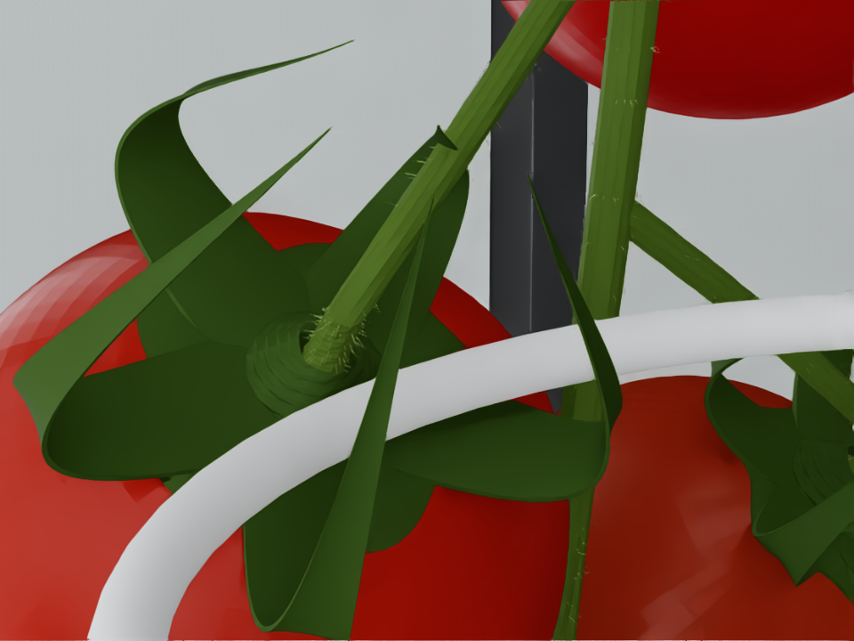

# 원본 식물의 탄성 굽힘·복원·파손

기존 house, 로봇, Ver.6 고리, 원본 송이와 열매 11개를 사용한다.
기본 대상은 앞서 고리 걸기에 성공한 최상단 열매가 아니라, 중간의 붉은
`Tomato_06`이다. 원본 USD 파일은 수정하지 않고 실행 장면에 물리 구조와
시각 메시 변형을 덧붙인다. v2에서는 원본의 서로 맞지 않는 꼭지 접합 단면을
실행 장면에서 보정하고, 접합면을 실제 연결 프레임에 묶는다.

## v3: 주줄기 접촉으로 송이 전체가 밀리는 실패 시험

```bash
# 원래 greenhouse, 로봇, 식물 위치를 그대로 사용
./nvidia-sim/run_elastic_stem.sh --elastic-action main-push --record
# 렌더링 없이 물리만 검사
./nvidia-sim/run_elastic_stem.sh --elastic-action main-push --headless
```

`STEM_MainStem`을 16개 물리 구간으로 나누고 맨 아래 구간만 고정한다.
송이 지지 가지의 뿌리는 가까운 주줄기 구간에 연결한다. 따라서 주줄기 접촉력이
주줄기 → 송이 지지 가지 → 송이 중심 줄기 → 꼭지 → 열매 순으로 전달된다.
열매 좌표를 코드로 따라가게 만드는 방식이 아니라 PhysX 관절이 움직임을 전달한다.
주줄기 강성 초기값은 구간별 100Nm/rad, 감쇠는 3Nms/rad이며 실측 보정값은 아니다.

`main-push`는 목표 꼭지 대신 주줄기로 잘못 접근하는 진단 동작이다.
잎이 적은 송이 아래쪽에서 고리가 실제 주줄기 충돌체를 누르고 후퇴한다. 외력으로 식물을 움직이지 않는다.
접촉력, 각 열매 이동, 송이 무게중심 이동, 주줄기 복원, 연결부 간격을 기록한다.
**이 시험의 통과는 주줄기 직접 접촉·송이 동반 이동·실패 판정의 재현을 뜻하며 수확 성공을 뜻하지 않는다.**
`main-push`의 복원 2mm 기준은 `precision_recovery_passed`로 별도 보고한다.
이 접촉 재현 검사 통과가 정밀 복원 검사 통과를 의미하지 않는다.
기존 성공 궤적과 비교해 성공률 저하를 검증한 시험도 아니다.

탄성 환경에서 로봇의 어느 충돌체든 주줄기에 0.1N 초과 접촉하면
`main_stem_collision`을 기록하고 RL 에피소드를 실패로 종료하며 -10 보상을 한 번 적용한다.
단순 접촉을 실패로 보는 것은 학습용 규칙이며 실제 식물 파손 판정은 아니다.
진단 동작은 실패 이후에도 후퇴·복원을 관찰한다. 꼭지 파손은 기존 native PhysX
파손 관절로 판단하며 주줄기 접촉 이력이 있으면 수확 성공으로 집계하지 않는다.

잎과 잘린 가지의 원본 시각 메시도 붙어 있는 주줄기 구간을 따라 움직인다.
충돌은 잎 조각별 볼록 형상이며 털과 미세 잎맥은 시각 표현만 유지한다.
원본에서 겹쳐 있는 잎·곁가지끼리의 충돌은 제외하되 로봇·열매·줄기와의 충돌은 유지한다.
잎 자체의 탄성은 구현하지 않았으며 질량은 기존 줄기 근사값을 사용한다.
주줄기가 고정돼 있던 v2 체크포인트는 v3 탄성 환경에 그대로 불러올 수 없다.

### v3 주줄기 직접 접촉 결과

[주줄기 접촉 2배속 영상](validation/main_stem_contact_2x.mp4) ·
[주줄기 직접 접촉 화면](validation/main_stem_contact.png) ·
[변위·접촉력 그래프](validation/main_stem_contact_trace.png) ·
[검증 기록과 기존 검사 실패 내역](validation/main_stem_validation.json)

- 주줄기 실제 캡슐 접촉: 최대 0.821N.
- 주줄기 전체 중 최대 이동: 53.82mm. 아래 접촉 구간보다 위쪽의 변위가 크다.
- 송이 중심 이동: 30.37mm. 열매 11개는 각각 29.58~31.84mm 이동했다.
- 고정된 밑동 이동: 0. 열매 파손: 0. `main_stem_collision_failure=true`, 수확 성공: false.
- 하중 중 표시 접합면 최대 간격: 0.00562mm. 모든 열매는 native 관절로 연결된 채 움직였다.
- 후퇴와 8초 관찰 뒤 주줄기 잔류 오차: 4.23mm, 송이 중심: 2.54mm.
  접촉·동반 이동·실패 분류 재현은 통과했으나 `precision_recovery_passed=false`다.

그래프는 접촉한 **아래쪽 구간**과 송이 중심의 X 변위를 비교한다.
잔여 가지가 먼저 닿던 높이에서 같은 주줄기 구간 안쪽으로 약 2.4cm 옮겨,
곁가지/잎 접촉을 주줄기 직접 접촉으로 잘못 집계하지 않도록 확인했다.
원본 greenhouse/식물 USD와 로봇 URDF의 해시는 기존 검증 기록과 같다.
기하 단위 검사 19개가 통과했다. 이는 아래 정밀 복원 검사 실패와 별개다.
영상은 직접 접촉·후퇴·복원 일부를 담고 종료했다. 전체 8초 복원 검사는 별도의
headless 실행 결과다. 원본 436프레임을 그대로 15fps→30fps로 재생한 2배속이며
물리 계산값과 시간 간격은 바꾸지 않았다. 영상 전체 디코딩 검사도 통과했다.

### v3 정밀 복원 검사의 제한

현재 0.3N 직접 하중 시험에서는 열매가 30.71mm 이동하고, 하중 제거 12초 뒤
2.86mm의 잔류 위치 오차가 관측됐다. 11개 열매의 연결은 유지됐고 초기화하면
시작 위치로 돌아오지만, **기존 1mm 정밀 복원 기준에는 미달한다**.
`validate`는 이를 실패로 기록하며 이 경우 과부하 파손 단계는 건너뛴다.
기존 꼭지 밀기 `push`도 실제 접촉·무파손은 확인됐으나, 줄기 복원 오차
2.48mm로 기존 2mm 기준에 미달한다. 기존 검사 임계값을 완화하지 않았다.
따라서 v2의 정밀 복원·과부하 검증 통과를 v3 전체 식물 모델의 검증으로 간주하지 않는다.

## 이전 v2 검증 기록 (주줄기 고정 모델)

[접합부 확대 영상](validation/elastic_attachment_fixed.mp4) ·
[고리 밀기 영상](validation/elastic_seam_fixed_close.mp4) ·
[접합부 수정 검증](validation/elastic_seam_validation.json)



v2 고리 동작에서 목표 꼭지의 보고 최대 접촉력은 0.532N,
줄기 구간의 기준 위치 대비 최대 이동은 3.33mm, 열매 중심의 이동은 2.48mm였다.
후퇴·관찰 후 최대 줄기 복원 오차는 0.153mm, 열매 중심 오차는 0.085mm였다.
열매 파손은 없었지만 후퇴 중 목표 과육에 최대 0.112N 접촉이 보고되었다.
과육 손상 모델은 없으므로 이 결과를 무손상 수확으로 해석하지 않는다.

별도의 직접 하중 시험 결과:

| 강성 배율 | 0.3N을 2초 가한 끝의 열매 변위 | 힘 제거 4초 뒤 오차 | 6N 과부하 native 파손·초기화 재부착 |
|---|---:|---:|---|
| 1.0 | 6.99mm | 0.107mm | 통과 |
| 0.5 | 10.83mm | 0.215mm | 통과 |

하중 중에는 진동하므로 표의 변위는 최대값이나 정적 평형값이 아니다.
고리 밀기 시험에서 과육–중심 줄기의 최소 충돌체 간격은 약 1mm였다.
이 결과를 **2mm 두께의 고리가 밀착 틈을 완전히 통과했다는 증거로 사용하지 않는다.**

## 접합면이 벌어져 보이던 문제의 수정

기존 검증은 물리 관절의 연결점만 확인했다. 또한 초기화 코드가 PhysX 초기화 후
열매의 변환 스택을 `MakeMatrixXform`으로 교체하면서 물리 좌표와 표시 좌표가
어긋났다. 단면 보정만 적용한 GUI 재현에서도 실제 표시 메시 간격이 2.12mm로
나타나 검증에 실패했다. 탄성 환경에서는 이 스택 교체를 제거하고, USD의 열매
위치와 PhysX 위치를 함께 검사한다.

별개로 원본 USD의 proximal/distal
꼭지 메시들은 끝 단면의 중심만 같고, 단면 방향과 반지름이 달랐다.
`Tomato_06`의 가장자리 불일치는 장면 배율 0.5에서 약 0.688mm였고,
열매 11개 모두 같은 유형의 문제가 있었다. 여기에 거리 기반 메시 변형이
접합면까지 이웃 줄기 구간의 움직임을 섞어 작은 추가 오차를 만들었다.
열매는 이전 시험에서도 약 1.83mm 움직였지만, 물리 연결이 유지된다는 사실만으로
화면의 연결이 올바르다고 판단한 것은 충분하지 않았다.

v2 수정:

- 원본 파일을 덮어쓰지 않고, 실행 시 줄기 끝 단면을 열매 쪽 단면에 맞춘다.
  마지막 6개 원본 메시 단면에 보정을 점진적으로 적용하고 법선·표면 털도 갱신한다.
- 탄성 관절의 회전 중심을 임의의 에셋 원점에서 실제 접합 단면으로 옮긴다.
- 줄기의 마지막 단면은 연결 프레임을 100% 따라가게 한다. 열매의 이동은
  계속 PhysX 관절과 접촉으로 계산하며 위치를 강제로 맞추지 않는다.
- 실제 USD 메시 양쪽 가장자리의 간격을 검사한다. 중심 간격만으로 통과시키지 않는다.
  기본 하중 시험의 정착·하중·복원 측정에서 11개 접합면의 최대 간격은 0.003mm 미만이었다.
  native 파손 뒤에는 양쪽이 분리되는 것이 정상이다.

[표시 동기화 수정 전 밀기](validation/elastic_attachment_before.png) ·
[수정 후 같은 밀기](validation/elastic_attachment_fixed.png) ·
[수정 후 초기 접합면](validation/elastic_attachment_rest_fixed.png)

이전 `elastic_validation.json`, `elastic_close.mp4` 등은 v1 이력이다.
주줄기가 고정된 v2 동작과 접합면의 근거는 위의 v2 영상 및 `elastic_seam_validation.json`을 사용한다.

## 실행

저장소 루트에서:

```bash
# 피지컬 모니터 DISPLAY=:0: 실제 고리로 밀고 후퇴, 복원 관찰
./nvidia-sim/run_elastic_stem.sh

# 같은 동작의 근접/전체 영상과 접촉·변위 기록
./nvidia-sim/run_elastic_stem.sh --record --run-dir nvidia-sim/rl/runs/my_elastic_push

# 힘을 직접 가하는 별도의 물성/파손/리셋 검사 (로봇 수확 성공 시험이 아님)
./nvidia-sim/run_elastic_stem.sh --headless --elastic-action validate \
  --run-dir nvidia-sim/rl/runs/my_elastic_validation

# 강성을 절반으로 바꾸어 같은 하중에서 비교
./nvidia-sim/run_elastic_stem.sh --headless --elastic-action validate \
  --elastic-stiffness-scale .5 --run-dir nvidia-sim/rl/runs/my_elastic_soft
```

래퍼는 `DISPLAY=:0`을 사용하며, 다른 화면은 `FARMILY_DISPLAY=:N`으로 지정한다.
`--headless`는 창을 열지 않는다. 기존 고정 줄기 데모 `run_hook_harvest.sh`는
기본적으로 기존 물리 모델을 사용한다. 탄성 장면은 `--plant-model elastic`로
명시적으로 선택하며, 기존 학습 체크포인트와 물리 모델이 다르면 실행을 거부한다.

## 물리 모델

- 송이를 지지하는 가지 5구간, 송이 중심 줄기 14구간, 각 열매의 작은 가지
  3구간씩, 주줄기 16구간을 합쳐 총 68개 rod와 끝 연결 프레임 11개를 사용한다.
- 주줄기 맨 아래 구간은 고정하고 나머지를 회전 스프링/감쇠 관절로 연결한다.
  관절의 길이 방향은 늘어나지 않는다. 송이 지지 가지도 주줄기에 연결된다.
- 239개의 원본 `TRUSS`·`STEM` 시각 메시가 계산된 몸체 변환을 따라 움직인다.
  메시 갱신은 렌더링용이며 물리 몸체를 목표 위치로 이동시키지 않는다.
  꼭지 끝의 단면 불일치는 위에서 설명한 국소적인 메시 보정으로 닫는다.
- 충돌은 원본 튜브의 중심선과 반지름에서 생성한 캡슐 구간이다.
  표면 털은 시각 표현만 유지한다. 과육은 원본 구형 충돌체, 꼭지 말단은 기존
  캡슐 근사다. 꽃받침 잎은 별도의 충돌/탄성 모델이 없으며 시각 표현으로 남는다.
  정확한 모든 잎·털의 변형/접촉을 모델링한 것은 아니다.
- 열매와 줄기의 충돌을 활성화한다. 실제로 이어져 원본부터 겹치는 뿌리 접합면,
  인접 연결 구간, 자기 열매의 말단 연결 구간, 위에서 설명한 잎·곁가지끼리의 충돌을 제외한다.
- 열매는 별도 강체이며, 탄성 골격의 끝에 **파손 가능한 일반 fixed joint**로
  연결한다. 기본 원본 임계값 3N / 0.08N·m을 유지한다. 거리에 따라 joint를
  삭제해서 파손을 흉내 내지 않는다.

기본값은 실측값이 아닌 시뮬레이션 근사값이다. 다음 수치는 관절 하나당 값이다.

| 위치 | 강성 (N·m/rad) | 감쇠 (N·m·s/rad) |
|---|---:|---:|
| 식물 주줄기 | 100 | 3 |
| 송이 지지 가지 | 25 | 1 |
| 송이 중심 줄기 | 2 | 0.15 |
| 열매 가지·꼭지 연결 | 0.25 | 0.02 |

강성 배율을 바꾸면 감쇠에는 배율의 제곱근을 적용한다.
USD 각도 단위는 degree이므로 저작 시 rad 기준 강성/감쇠를 변환한다.
열매 무게는 원본 값을 유지한다. rod 밀도는 1000kg/m³, 최소 구간 질량은 0.5g,
연결 프레임 질량은 0.5g이다. 작은 줄기와 열매의 큰 관성 차이를 안정적으로
계산하기 위해 관절 armature 1e-5kg·m²를 추가했다. 이것도 실측 식물 관성이 아니다.
물리 계산은 960Hz, 로봇 명령/기록은 60Hz다.

원본 메시를 중력이 작용하는 기준 모양으로 해석해, 각 관절 아래 열매·줄기의
무게로부터 정적 초기 하중을 계산한다. 이 초기 하중은 0도 스프링과 일정한 관절 토크의 합으로 적용하며 접촉과 파손 중에도
고정된다. 구형 관절의 0이 아닌 위치 목표로 적용했을 때 나타난 큰 초기 처짐을 피한다. 식물의 중력을 끄거나, 매 프레임 원래 모양으로 되돌리는 보정은 없다.
충돌과 근사 오차 때문에 시작 후 약간의 평형 이동은 있을 수 있다.

## 검증과 성공의 범위

`validate`는 중력 아래 정착 → 목표 열매에 0.3N → 하중 제거 → 복원 →
6N 과부하에 의한 native break → 초기화 후 재부착을 검사한다.
복원 오차 1mm 미만, 탄성 관절 연결점 오차 0.5mm 미만,
파손 전 메시 접합면 오차 0.05mm 미만, 작은 하중에서
열매 파손 없음 등을 요구한다. 실패하면 결과를 저장하고 비정상 종료한다.

`push`는 ROS `PICK_READY`와 송이보다 40cm 낮은 리프트 시작 조건을 유지한다.
실제 관절 드라이브로 고리를 꼭지 쪽으로 이동시키고, 낮춘 드라이브 강성과
물리 substep의 접촉력 감시를 사용해 밀다가 후퇴한다. 외력을 열매에 직접
가하지 않는다. 접촉 상대, 변위, 복원 오차, 타겟/이웃 열매 파손을 기록한다.
이는 **밀기와 복원 시험**이며 고리 삽입·분리·과실 회수의 완성된 수확 정책이 아니다.

기록 파일:

- `elastic_result.json`, `elastic_trace.json`, `elastic_contacts.json`: 하중 검사.
- `elastic_push_result.json`, `elastic_push_trace.json`, `elastic_push_contacts.json`: 고리 접촉 검사.
- `main_stem_push_result.json`, `main_stem_push_trace.json`, `main_stem_push_contacts.json`: 주줄기 직접 접촉·송이 이동·실패 판정.
- `elastic_video/main_stem.mp4`: 주줄기 시험 영상.
- `elastic_video/close.mp4`, `overview.mp4`, `attachment.mp4`, 단계별 PNG: `--record` 영상.
- `scene_provenance.json`: 원본 장면, 대상과 탄성 모델 정보.

틈이 충분히 벌어질지는 초기 형상, 강성, 마찰과 허용 힘에 달려 있다.
실제 토마토에서의 성능을 예측하려면 품종·숙도별 힘–변위, 복원과 파손 데이터를
측정해 맞춰야 한다. 현재 모델에는 과육 멍, 영구 변형, 조직 피로, 찢어짐 전파가 없다.

강성 변경은 반드시 `validate`로 재검증해야 한다. 이전 v2의 배율 2 시험에서는 초기 파손이
발생했으며 유효한 물성 결과로 취급하지 않는다. 숫자만 높이면 더 현실적인
식물이 되는 것은 아니며, 접촉 근사와 시간 간격·관절 관성의 안정성도 함께 검토해야 한다.

## 기술 근거

- [NVIDIA 관절/드라이브](https://docs.omniverse.nvidia.com/kit/docs/omni_physics/107.3/dev_guide/rigid_bodies_articulations/joints.html)
- [USD 드라이브 단위](https://openusd.org/dev/api/class_usd_physics_drive_a_p_i.html)
- [PhysX 관절 파손과 드라이브 힘의 구분](https://nvidia-omniverse.github.io/PhysX/physx/5.4.0/docs/Joints.html)
- [PhysX의 USD 변환 갱신 API](https://docs.omniverse.nvidia.com/kit/docs/omni_physics/107.0/extensions/runtime/source/omni.physx/docs/api/python.html)

탄성 articulation 내부 관절의 파손 기능에 의존하지 않는다. 별도 열매 연결부의
native break를 직접 검증하여, 드라이브 힘이 자체 관절 파손 판정에서 제외되는
문제와 구분한다.
