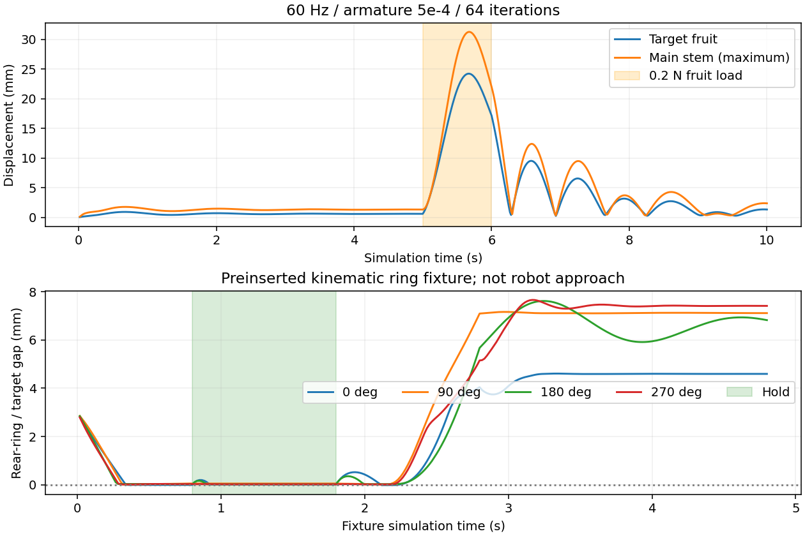

# 다중 로봇 실험용 저주파 물리

실제 움직임을 확인할 [60Hz 접촉·탄성 영상과 촬영 설명](GPU_PHYSICS_VIDEOS.md)을 추가했다.

## 현재 선택

사용자 요구에 따라 기준을 바꿨다. 기존 960Hz 궤적과 1mm 이내로 일치하는 대신,
**접촉에 따른 변형, 고리의 접촉 유지, 복원, 원래 임계값에서의 파손**을 검사한다.
정확한 식물 물성 재현이나 실물 성공률 검증을 완료했다는 뜻은 아니다.

GPU dataset 기본 preset은 **`contact120`**이다. 후속 candidate_00049에서
60Hz의 얇은 줄기 관통을 확인해 시간 간격을 절반으로 줄였다.
아래 60Hz 기능 시험은 과거 기록이며 모든 접근 경로의 접촉 정확도를 보장하지 않는다.
새 진단 및 적용 범위는 [CONTACT_PENETRATION_FIX.md](CONTACT_PENETRATION_FIX.md)를 참고한다.

| preset | 물리 | 제어 | plant armature | position/velocity iterations |
|---|---:|---:|---:|---:|
| `contact120` (기본) | 120Hz | 60Hz | 5e-4 kg·m² | 64 / 4 |
| `practical60` (과거 비교용) | 60Hz | 60Hz | 5e-4 kg·m² | 64 / 4 |
| `practical120` | 120Hz | 60Hz | 3e-4 kg·m² | 64 / 4 |
| `reference960` | 960Hz | 60Hz | 1e-5 kg·m² | 64 / 4 |

`practical60`을 아래 기능 시험으로 확인했다. `practical120`은 중간 비교용이며,
작은 토크의 복원 및 4환경 경로 재생을 확인했다. 두 preset의 관성이 달라
Hz만의 비교는 아니다. 진단 도구와 다른 시뮬레이터 실행기의 기본값까지 바꾸지는 않았다.

PGS / GPU dynamics / native collider readback / GPU partition 1은 유지한다.
원래 식물 geometry, 로봇, 접촉체, 주줄기 탄성, 강성/감쇠, 마찰, 과실 질량,
3N / 0.08N·m 파손 임계값은 유지했다. 보조 관성은 동적 응답을 바꾼다.
단순 배속이 아니므로 이전 모델의 데이터와 같은 물리 조건으로 합치지 않는다.

```bash
# 선택값을 명시하는 권장 명령. 4대가 총 8개 후보를 나눠 실행한다.
./nvidia-sim/run_gpu_candidate_dataset.sh \
  --physics-preset contact120 --num-envs 4 --candidates 8 --schedule continuous

# 중간 주파수
./nvidia-sim/run_gpu_candidate_dataset.sh \
  --physics-preset practical120 --num-envs 4 --candidates 8 --schedule continuous

# 과거 기본 물리로 되돌리기
./nvidia-sim/run_gpu_candidate_dataset.sh \
  --physics-preset reference960 --num-envs 4 --candidates 8 --schedule continuous
```

`--physics-hz`, `--elastic-joint-armature`, `--position-iterations`는 preset 값을 덮어쓴다.
시작 로그 `[DATASET PHYSICS CONFIG]`, config, backend, 후보 metadata에 실제 값을 남긴다.
예를 들어 `--physics-hz 960` 하나만으로는 원래 관성까지 돌아오지 않는다.
원래 모델을 원하면 반드시 `--physics-preset reference960`을 쓴다.
이전 설정의 실행을 새 preset으로 resume하는 것은 거부한다. 새 출력 폴더를 사용한다.

## 레퍼런스에서 확인한 범위

2026-09-21 조사. 아래 값은 서로 다른 물체/솔버/접촉 문제의 예이며
토마토 꼭지에 그대로 적용해도 된다는 보증이 아니다.

| 1차 자료 | 확인한 설정/방법 | 이 작업에 주는 근거 |
|---|---|---|
| [Isaac Lab v2.3.0 Lift](https://raw.githubusercontent.com/isaac-sim/IsaacLab/v2.3.0/source/isaaclab_tasks/isaaclab_tasks/manager_based/manipulation/lift/lift_env_cfg.py) | dt=0.01, decimation=2: 물리 100Hz, 제어 50Hz | 일반 manipulation에 960Hz가 보편적으로 필수인 것은 아님 |
| [Isaac Lab v2.3.0 Factory](https://raw.githubusercontent.com/isaac-sim/IsaacLab/v2.3.0/source/isaaclab_tasks/isaaclab_tasks/direct/factory/factory_env_cfg.py) | 물리 120Hz, decimation=8, TGS position iteration 최대 192 | 정밀 삽입도 Hz와 솔버 반복을 함께 설계함; 낮은 Hz가 자동으로 낮은 계산비를 뜻하지 않음 |
| [ManiSkill 공식 custom task 문서](https://github.com/mani-skill/ManiSkill/blob/main/docs/source/user_guide/tutorials/custom_tasks/advanced.md) | 기본 sim_freq=100, control_freq=20, solver_iterations=15 | 병렬 manipulation에서 100Hz급 물리가 실제 사용됨 |
| [MuJoCo 공식 performance tuning](https://mujoco.readthedocs.io/en/stable/modeling.html#performance-tuning) | 시간 간격을 늘리되 모델별 발산을 확인; integrator와 solver도 조정 | 엔진 공통의 유일한 적정 Hz는 없음 |
| [PhysX 공식 articulation stability](https://nvidia-omniverse.github.io/PhysX/ovphysx/latest/guides/articulation_stability.html) | 질량/관성 비, drive 강성/감쇠, armature와 timestep을 함께 검토 | 작은 관성의 가는 가지를 저주파에 맞게 안정화할 근거 |
| [Gazebo Plants (2024)](https://arxiv.org/html/2402.02570v1) | Cosserat rod + 위치 기반 제약, 로봇→식물 단방향 결합; 특정 2,242 rod 장면에서 real-time ratio 0.93 보고 | 식물 전체를 고주파 rigid-joint 체계로만 풀어야 하는 것은 아님. 그 성능을 현재 PhysX 고리 접촉/파손에 그대로 대입할 수는 없음 |

이 자료들을 바탕으로 120Hz를 중간 후보, 60Hz를 더 적극적인 처리량 후보로 삼았다.
30Hz도 진단했지만 이번 설정에서는 복원/잔류 변위가 커 채택하지 않았다.
다른 모델로 30Hz가 불가능하다는 결론은 아니다. 현재 60Hz 명령 재생을 30Hz 물리에
그대로 넣으면 동작 시간이 틀어지므로 worker는 그 조합을 거부한다.

## 기능 검사와 결과

원래 식물/과실 11개를 사용하는 별도의 `--behavior-probe`를 추가했다.
식물을 강제로 이동시키거나 초기 위치로 끌어오는 힘은 넣지 않는다.
진단 결과는 harvest dataset 라벨로 저장하지 않는다.

`60Hz / armature 5e-4 / 64 iterations`의 측정:

| 검사 | 결과 |
|---|---|
| 5초 정지 | 목표/주줄기 최대 변위 약 1.76mm, 자발적 파손 없음 |
| 목표 과실에 world-X 0.2N, 1초 하중 | 최대 과실 변위 24.24mm, 주줄기도 함께 이동 |
| 하중 제거 4초 뒤 | 과실 잔류 변위 1.32mm |
| 하중/복원 중 연결부 최대 간격 | 약 0.240mm |
| 원래 임계값에서 6N 과부하 | 목표 연결부만 native joint break |
| 파손 후 리셋 및 2초 관찰 | 재부착, 비목표 파손 없음 |
| CAD 반고리+레일의 네 방향 시험 | 네 방향 모두 1초 hold 동안 목표 꼭지 접촉/안쪽 걸림 유지 |
| 고리–목표 꼭지 최대 겹침 | 약 0.014mm; 측정한 네 방향 범위 |

실용 검사의 기준: 정지 목표/주줄기 이동 3mm 미만, 하중 시 유한한 1~100mm 변형,
회복 잔류량 최대 변위의 25% 또는 1mm 미만, 부착 간격 0.5mm 미만,
원래 과부하 파손/리셋 성공, 고리 hold의 80% 초과 안쪽 걸림 및 native 목표 접촉.
고리 간격은 매 physics step 검사하며 1mm 이상 겹치는 경우 통과시키지 않는다.

**고리 시험 범위:** GT로 목표 꼭지 주변에 미리 삽입된 별도 kinematic 고리를 배치하고,
8mm 이동(10mm/s), 1초 유지, 12mm 후퇴를 수행한다. 원래 32개 반고리 capsule과
두 직선 레일을 사용하며 proximal assembly는 포함하지 않는다.
로봇의 IK/접근/삽입 성공 시험은 아니다. 다른 각도·속도의 관통 부재를 보증하지 않는다.

원래 로봇도 별도로 저장 명령 `candidate_00003`을 실행했다.

| 설정 | 1환경 motion wall | 4환경 motion wall | 진행 sim 시간 |
|---|---:|---:|---:|
| 기존 960Hz / 1e-5 | 156.25초 | 168.69초 | 4.333초 |
| 채택 60Hz / 5e-4 | 11.92초 | 17.50초 | 4.400초 |

4환경 계산 시간은 이 시험에서 약 9.6배 짧았다. 초기화는 제외했고, 물리 모델과
종료 시점이 다르므로 과거의 엄격한 동등성 speedup으로 보고하지 않는다.
최종 결과는 모두 비목표 잎 접촉 뒤 `excessive_displacement`다.
실제 접촉/식물 밀림/실패 판정이 유지된 증거이며, 수확 성공 증거는 아니다.
같은 명령을 복제한 성능 시험을 서로 다른 네 pose의 데이터 생성으로 세지 않는다.
1,000개/1시간 달성이나 고속 충돌, 모든 타겟의 수확 성공률은 아직 검증하지 않았다.

추가 **16환경 동시 재생**도 통과했다. 같은 sim 4.4초를 motion wall 27.71초에
계산했고, 16개 모두 같은 비목표 잎 접촉/과도 변위 분류였다. native 접촉 라우팅 오류가
없었으며 접촉 후 reset, 파손 이벤트/복구 검사가 통과했다. clone 간 위치 지표 차이는
최대 약 0.285mm로 정확한 비트 단위 일치는 아니다.

실제 데이터셋 실행기도 4환경/서로 다른 4후보/최대 480제어 스텝으로 검사했다.
RGB-D 저장, 초기 상태/reset, CPU 사전 계획, metadata 적용을 통과했고 총 52.22초였다.
1개는 `excessive_displacement`, 3개는 8초 제한에 걸려 `incomplete`다.
`dataset_complete=false`를 유지하며, 이를 4개 전체 후보가 완료된 처리량으로 환산하지 않는다.
관련 자동 테스트 **60개 통과**, `git diff --check` 통과.



상단은 변위의 크기이므로 0 근처로 돌아온 뒤 다시 커지는 구간을 함께 읽는다.
하단 녹색 구간은 고리 유지 단계이고, 이후 후퇴하면 간격이 벌어진다.

## 제외한 시도

- 30Hz / 1e-3 / 64: 진단 토크를 제거한 뒤 6초 시점 식물 바디 약 11.15mm,
  목표 과실 약 5.25mm 잔류. 동결하지는 않지만 현재 선택보다 불안정하다.
- 60Hz / 1e-3 / 32: 고리 유지와 파손은 동작했지만, 부착 간격 약 0.555mm로
  설정한 0.5mm 기준 초과. 반복 수 32는 기본값에 채택하지 않았다.
- 초기 60Hz / 3e-4는 고리 네 방향 검사에 통과했지만 주줄기 최대 정지 이동 약
  3.51mm였다. 초기 probe의 idle 판정이 목표 과실만 검사했던 점을 수정했다.
  해당 초기 `behavior60/behavior.json`의 passed 값만으로 최종 채택하지 않는다.

기준을 넘은 실험을 숨기거나 원래 960Hz와 일치한다고 재분류하지 않았다.

## 재현

```bash
/root/isaaclab_env/bin/python nvidia-sim/rl/gpu_low_hz_benchmark.py \
  --presets practical60 \
  --fixture nvidia-sim/rl/runs/20260920_160125_tomato_05_candidate_dataset/results/candidate_00003
```

한 GPU에서 순서대로 기능 검사와 1/4환경 저장 명령 재생을 실행한다.
원본 fixture가 없는 별도 머신에서는 `candidate.json`과 `planned_commands.npy`도 옮겨야 한다.
원본 실험: `runs/20260921_low_hz_practical/` (Git ignore 대상).
요약 기록과 제한: [검증 JSON](validation/gpu_practical_physics.json).
