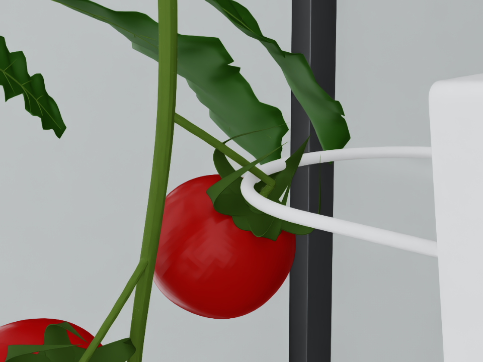

# 원본 온실에서 고리를 꼭지에 걸고 멈추기

사용자가 제시한 그림의 목표를 **아래 접근 → 과육 삽입 → 꼭지 높이로 상승 →
바깥쪽 당기기 → 꼭지 접촉 시 정지**로 구현했다. 기본 데모 대상은 원본 송이의
붉은 `Tomato_01`이다. 새로운 온실이나 단순 구형 열매로 교체하지 않는다.



[근접 영상](validation/hook_close.mp4) · [전체 로봇 영상](validation/hook_overview.mp4) ·
[반대 시점](validation/hook_contact_reverse.png) · [검증 결과 JSON](validation/hook_validation.json)

원본 고정 배치에서 headless 반복 **5/5**, GUI **1/1** 접촉 정지에 성공했다.
매회 5초 동안 열매 11개가 유지됐고, 과육 접촉 보고는 없었다.
최종 표면 간격은 약 0.264mm, 목표 꼭지의 최대 보고 접촉력은 약 1.40N이었다.
별도 아래쪽 열매의 native 분리 시험은 **3/3** 성공했고, 분리 후 1초 동안 다른 열매 파손이 없었다.
검색 기능 점검에서는 기존 성공 후보가 선택되고, 기하학적 간격이 좋아도 실제 줄기에
충돌한 새 후보는 실패 처리되는 것을 확인했다. 이는 새 후보 탐색의 일반적인 성공률이 아니다.
기존 물리 회귀 검사, 기하학 테스트 9개를 통과했고 GUI PhysX 오류는 0건이었다.

## 실행

저장소 루트:

```bash
# GUI에서 자동 접근하고 고리–꼭지 접촉 상태를 5초 관찰
./nvidia-sim/run_hook_harvest.sh

# GUI 없이 물리 실행 + 근접/전체 MP4와 단계별 PNG 저장
./nvidia-sim/run_hook_harvest.sh --headless --record \
  --run-dir nvidia-sim/rl/runs/my_hook

# 같은 원본 배치에서 반복 검증
./nvidia-sim/run_hook_harvest.sh --headless --hook-trials 5 \
  --run-dir nvidia-sim/rl/runs/my_repeat

# 접촉 후 관찰 시간을 늘리기
./nvidia-sim/run_hook_harvest.sh --hook-hold-seconds 15

# 아래쪽 Tomato_11의 실제 파손까지 진행하는 별도 시험
# 이 열매는 원본 장면에서 녹색이다. 숙도 판단/수확 의사결정을 검증하는 시험은 아니다.
./nvidia-sim/run_hook_harvest.sh --headless --hook-goal detach \
  --run-dir nvidia-sim/rl/runs/my_detach

# 기존 성공 후보를 포함해 새로운 후보를 탐색하고 PhysX로 비교
./nvidia-sim/run_hook_harvest.sh --headless --hook-search --hook-trials 8 \
  --target-fruit Tomato_01 --hook-config nvidia-sim/rl/configs/tomato01_engage.json \
  --run-dir nvidia-sim/rl/runs/my_search
```

`nvidia-sim` 디렉터리에서 실행하면 명령 앞의 `nvidia-sim/`을 생략한다.
기존 `run_sim.sh`, ROS GUI, 학습 실행기는 그대로 사용할 수 있다.
GUI 데모는 정해진 동작과 관찰을 마치면 종료한다.

## 무엇을 바꿨는가

- `contact_planner.py`: 물체 기준의 단계별 동작과 반원 고리–열매 간격 점수,
  CEM 후보 선별. 기하학적 점수만으로 성공을 결정하지 않는다.
- `hook_motion.py`: 실제 로봇 URDF의 FK/IK, 팔과 리프트의 연속 관절 구동,
  240Hz 접촉 감시, 정지 제어, 전체 물리 rollout 평가와 영상 저장.
- `configs/tomato01_engage.json`: 원본 배치에서 찾은 붉은 열매 접촉 설정.
  `tomato11_detach.json`: 아래쪽 열매 분리 시험 설정.
- 기존 환경의 삽입 판정에서 고리 법선의 부호를 양쪽 모두 허용했다.
  실제 GUI는 gripper +Y가 아래를 향하므로, 이전의 `axis_y > 0.7` 조건은
  올바른 GUI 자세도 삽입으로 인정하지 않았다.
- 접촉 상대·접촉 위치·힘과 native break 이벤트를 선택적으로 기록한다.

동작 시작은 기존 ROS `PICK_READY`이며 장착면은 송이 평균 높이보다 40cm 아래다.
이후 팔과 리프트를 함께 사용할 수 있다. 실제 관절 상태를 순간 이동하는 것은
에피소드 초기화뿐이며, 접근과 접촉은 PhysX 관절 드라이브로 실행한다.
기본 줄기 배치는 `(-0.75, 0.55, 0.32)`, scale 0.5, yaw 0°다.

마지막 접근은 2mm/s 명목 속도다. 접촉 전에 팔 드라이브 강성/감쇠를
30N·m/rad / 5N·m·s/rad, 리프트를 5000N/m / 500N·s/m로 낮춘다.
목표 꼭지 접촉이 보고되면 다음 물리 substep부터 위치 강성을 0으로 전환하고
속도 감쇠로 멈춘다. 이는 기존 환경의 이상적인 로봇 중력 보상을 전제로 한다.
실물 로봇에 이 gain 값을 그대로 적용하는 코드는 아니다.

열매 질량, 고리 형상, 잎과 줄기의 정적 collider, 원본 파손값 3N / 0.08N·m은
유지한다. 위치 조건으로 조인트를 삭제하거나 접촉 재질을 부드럽게 바꿔
성공시키지 않는다. 과육 접촉과 다른 열매 파손은 별도 기록한다.

## 성공 조건과 결과 파일

`engage`는 삽입 이력, 고리–목표 꼭지의 실제 접촉, 관찰 시간 동안 파손 없음,
최종 고리–꼭지 표면 간격 1.5mm 미만을 요구한다. 현재 PhysX의 contact offset
때문에 가시 표면에 작은 간격이 있어도 접촉 보고가 생길 수 있다.
이는 열매를 분리한 채 지탱하는 그립 성능을 의미하지 않는다.

`detach`는 실제 native break가 있어야 하며, 그 뒤 1초도 관찰한다.
위쪽 붉은 열매를 분리하는 순간에는 정상이어도, 떨어진 열매가 아래 열매에
충돌하는 사례를 발견했다. 이 경우 최종 성공으로 세지 않는다.
분리 후 과실 회수/낙하 방지는 아직 구현되어 있지 않다.

실행 폴더에 다음을 저장한다.

- `hook_summary.json`, `hook_results.json`: 목표별 성공, 파손, 최대 힘, 유지 시간과 간격.
- `hook_trace_*.json`: 실제 고리 자세, 관절 상태/명령, 타겟 중심, 단계별 접촉 이력.
- `hook_contacts_*.json`: collider 경로, 물리 접촉 위치와 native joint break.
- `successful_motion.json`, `best_hook.json`: 가장 좋은 성공 동작과 파라미터.
- `video_000/close.mp4`, `overview.mp4`, 단계별 PNG, 최종 상태의 여러 시점 PNG.

`best_hook.json`은 같은 장면 조건에서 `--hook-config`로 다시 실행할 수 있다.
배치 정보는 `scene_provenance.json`에 있다. 다른 spawn/yaw/scale에 대한 일반화는
고정 장면 반복 성공과 구분해야 한다. 다른 배치에는 후보 재탐색이 필요할 수 있다.

접촉력 수치는 PhysX가 보고한 collider 쌍의 접촉 impulse를 물리 시간 간격으로
나눈 값이며, 실물 로봇의 손목 힘/토크 센서 측정값은 아니다.

## 학습과의 관계

이번 기능은 **물리 검증을 거친 동작 파라미터 탐색과 접촉 피드백 제어**다.
PPO가 새로 학습한 정책이라고 부르지 않는다. CEM은 원본 열매 collider와
반원 고리의 기하학적 간격을 사용해 후보를 줄이고, 실제 시뮬레이션은 줄기·잎·
팔 전체 충돌과 파손을 포함해 평가한다. 전역 최적성이나 모든 열매 성공을 보장하지 않는다.

저장된 시연은 이후 모방학습이나 residual RL을 위한 데이터가 된다.
관절 위치 명령을 저장하므로 기존 PPO의 7차원 Cartesian delta 행동에 그대로
체크포인트처럼 넣을 수는 없다. 학습용 행동 변환과 무작위화가 다음 작업이다.
논문 비교와 선택 이유는 [조사 문서](CONTACT_RESEARCH.md)를 참고한다.
